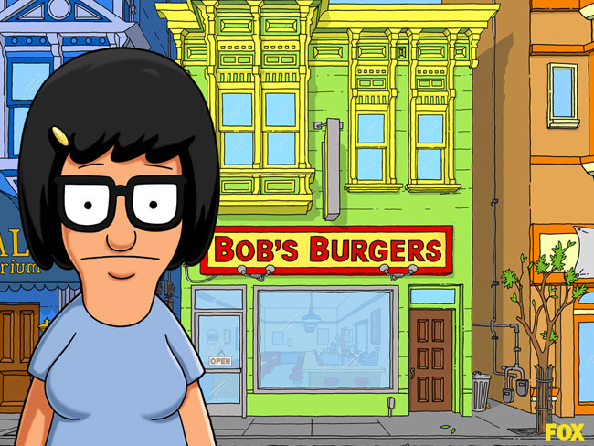

# Pic Picker Workshop

Hey NEWPATH! This is the Python rapid development talk.  I 
will be here for the whole time to answer any questions about
tools and stuff, but you'll mostly be working with each other
(in teams) to do the task below.

Feel free to get started on the 'Getting Setup' section before
the meeting starts, or while I am talking at the beginning.

## Getting Started

```sh
$ # to get started, clone the repo and enter it
$ git clone https://github.com/buckmaxwell/pic-picker.git
$ cd pic-picker
$
$ # now make sure you have python installed
$ sudo apt-get install python
$
$ # then install pip, the python package manager
$ sudo apt-get install python-pip
$
$ # install and activate a virtualenv
$ sudo pip install virtualenv
$ virtualenv venv
$ source venv/bin/activate
$
$ # Now install the requirements
$ pip install -r requirements.txt
$
$ # Run the project locally
$ python app.py 
$ 
```

Nice! Visit http://localhost:5000?search=Tina+Belcher to
see if you're up and running.




## Instructions

1. Create a team of 2 to 3 developers, 3m
2. Read the task, 5m
3. Read the tips, 2m
4. Get started, 25m
5. Discussion, 15m


## The Task, 30 min

The task is simple(ish), but the client who assigned
it doesn't seem to quite know what they want.  

From the conversations you've had with them you know 
they need a RESTful API that when given text, returns
an image. While they haven't explicitly said it, you 
are aware that almost every image being queried for,
and in their existing database, is an image from an animated
show or movie.  There are not very many images in the
existing database (but the client often refers to it as "big 
data").

The API you build will be called by mobile app, built by
other developers.  You have not talked to them before, 
and have been told they live in a different country.

Aside from these things, which you know from meeting 
with the client, you also have a list of "deliverables"
from the client which you must produce.

 - Build an API that returns a matching picture for some text
 - Do not include NSFW results
 - Always return results
 - Results must be good 

At any time you can ask the client (me) questions.  We will
discuss your solution after 25 minutes.


## The Tips

Here are some tips to help you on your way.

 - You've only got 25 minutes.  That's not enough time to do
   whatever you have in mind.
 - Arguing over implementation is a luxury you might not have
 - If you use your team well, it's like you have 75 minutes
 - Do a good enough job to get a second meeting


## Resources


 - Data -- a folder with the images the client currently has
 - app.py -- a bootstrap file (place to start)
 - [Python 2.7 Documentation](https://docs.python.org/2/)
 - [Flask Documentation](http://flask.pocoo.org/)
 - [HTTP Requests Library Documentation](http://docs.python-requests.org/en/master/)
    * The requests library is not necessarily needed, but could come in handy

